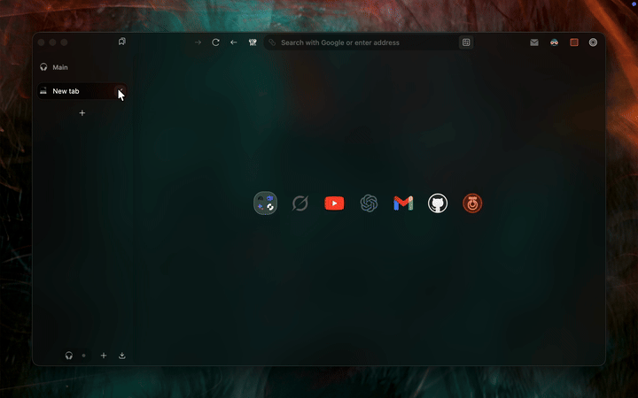

# Better Zen Start Page

  

---

## ⚠️ REQUIREMENT: Install the Font
This mod uses **Libre Baskerville** for the logo. You **must** install it manually.

1.  **[Download Libre Baskerville](https://fonts.google.com/specimen/Libre+Baskerville)** (Google Fonts).
2.  Click **"Get Font"** -> **"Download all"**.
3.  **Windows:** Unzip -> Right Click `.ttf` files -> "Install".
4.  **Mac:** Unzip -> Double Click `.ttf` files -> "Install Font".
5.  **Restart Zen Browser.**

---

## Other Features

### Enabled by Default:
*   **[ON] Start Page Logo:** Adds the animated "Welcome to a calmer internet" SVG to your new tab.
*   **[ON] Fade In Transparent Background:** Adds a subtle gradient fading in from the left, making the browser stack feel seamless and sophisticated.

### Optional (Disabled by Default):
*   **[OFF] Transparent Tabs & Dot Indicator:** Removes tab backgrounds and adds a notification dot for open apps.
*   **[OFF] Clean UI:** Hides the bookmarks toolbar and harsh borders.
*   **[OFF] Pending Tab Status:** Adds a moon icon 🌙 and dims unloaded tabs.
*   **[OFF] Essentials Grid:** Optimizes the layout of the essentials panel.

*(You can turn these ON in Zen Settings > Zen Mods)*

## Installation (Via Sine)
1.  Open Zen Browser Settings -> **Sine** (or Zen Mods).
2.  Click **"Install from Git"**.
3.  Paste this repo URL: `https://github.com/aree6/Better_Zen_Start_Page`
4.  Click **Install**.